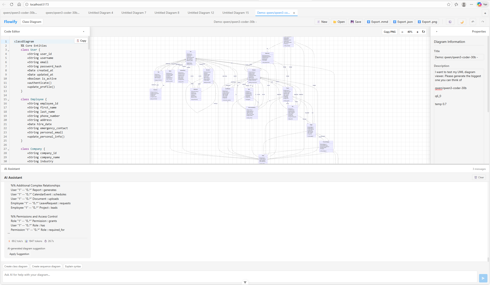
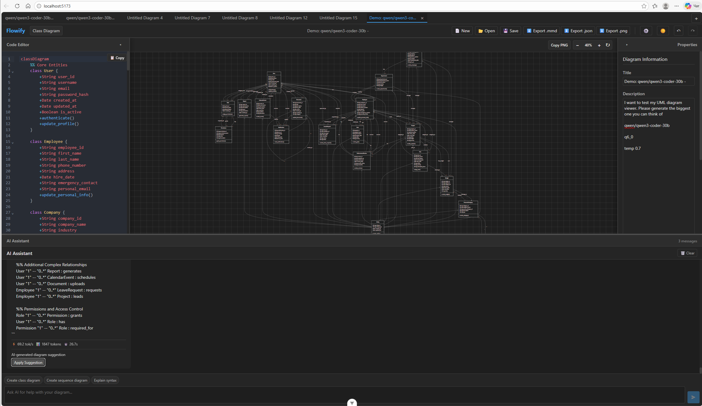
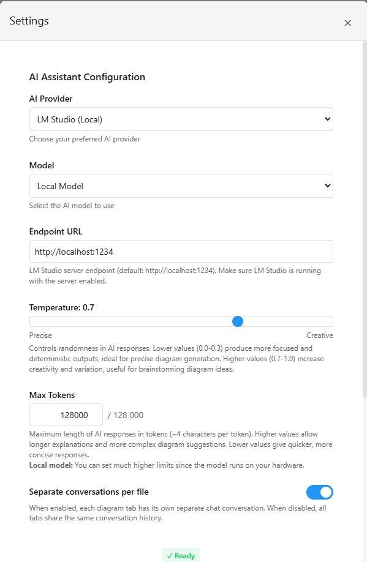

# Flowify

A modern UML diagram editor built with Vue 3 that supports creating and editing diagrams using Mermaid.js syntax. Features an AI-powered chat assistant that helps you create and modify diagrams using OpenAI, Anthropic, or local AI models.

## Screenshots

| Light Theme | Dark Theme |
|-------------|------------|
|  |  |

## Features

### Diagram Editor
- **10 Diagram Types**: Class, Sequence, Flowchart, State, ER, Gantt, Pie, Mind Map, Timeline, Git Graph
- **Real-time Preview**: See your diagrams render as you type
- **Syntax Highlighting**: CodeMirror editor with Mermaid syntax support
- **Multi-tab Support**: Work on multiple diagrams simultaneously
- **Undo/Redo**: Full history support per tab

### AI Assistant
- **Real-time Streaming**: Word-by-word AI responses
- **Context-Aware**: AI understands your current diagram and can suggest improvements
- **Multi-Provider Support**:
  - OpenAI (GPT-4o, GPT-4o-mini, GPT-3.5-turbo)
  - Anthropic (Claude 3.5 Sonnet, Claude 3.5 Haiku, Claude 3 Opus)
  - LM Studio (local models via OpenAI-compatible API)

### User Experience
- **Light/Dark Theme**: Full theme support including editor and diagram rendering
- **Zoom & Pan**: Mouse wheel zoom (Ctrl+scroll) and drag to pan
- **Grid Background**: Toggle-able grid with adjustable size
- **Export Options**: Copy diagrams as [high-quality PNG](https://raw.githubusercontent.com/Berezhnyk/flowify/main/docs/export-png-high-resolution.png) to clipboard (4x resolution)
- **Auto-save**: Automatic localStorage persistence
- **Resizable Panels**: Drag-to-resize 4-panel layout

## Getting Started

### Prerequisites

- Node.js 20.19.0+ or 22.12.0+
- npm or yarn

### Installation

```bash
# Clone the repository
git clone https://github.com/Berezhnyk/flowify.git
cd flowify

# Install dependencies
npm install

# Start development server
npm run dev
```

The application will be available at `http://localhost:5173`

### Build for Production

```bash
npm run build
```

## AI Configuration

To use the AI assistant, configure your preferred provider in the Settings panel:



### OpenAI
1. Get an API key from [OpenAI Platform](https://platform.openai.com/api-keys)
2. Enter your API key in Settings > AI Settings
3. Select OpenAI as the provider and choose a model

### Anthropic
1. Get an API key from [Anthropic Console](https://console.anthropic.com/settings/keys)
2. Enter your API key in Settings > AI Settings
3. Select Anthropic as the provider and choose a model

### LM Studio (Local Models)
1. Install [LM Studio](https://lmstudio.ai/)
2. Start the local server (default: `http://localhost:1234`)
3. Select LM Studio as the provider in Settings
4. Configure the endpoint URL if different from default

**Note**: API keys are stored locally in your browser and are never sent to any server other than the respective AI provider.

## Development

```bash
npm run dev          # Start dev server with HMR
npm run build        # Type-check and build for production
npm run type-check   # Run TypeScript type checking
npm run format       # Format code with Prettier
npm run preview      # Preview production build
```

## Tech Stack

- **Frontend**: Vue 3 (Composition API), TypeScript
- **Build Tool**: Vite
- **State Management**: Pinia
- **Editor**: CodeMirror 6
- **Diagrams**: Mermaid.js
- **Layout**: Splitpanes

## Supported Diagram Types

| Type | Description |
|------|-------------|
| Class Diagram | OOP class structures and relationships |
| Sequence Diagram | Message flows between participants |
| Flowchart | Process flows and decision trees |
| State Diagram | State machines and transitions |
| ER Diagram | Database entity relationships |
| Gantt Chart | Project schedules and timelines |
| Pie Chart | Data distribution visualization |
| Mind Map | Hierarchical idea organization |
| Timeline | Chronological events display |
| Git Graph | Git branch visualization |

## Contributing

Contributions are welcome! Please read the [Contributing Guidelines](CONTRIBUTING.md) before submitting a pull request.

## Security

For security concerns, please see our [Security Policy](SECURITY.md).

## License

This project is licensed under the MIT License - see the [LICENSE](LICENSE) file for details.
